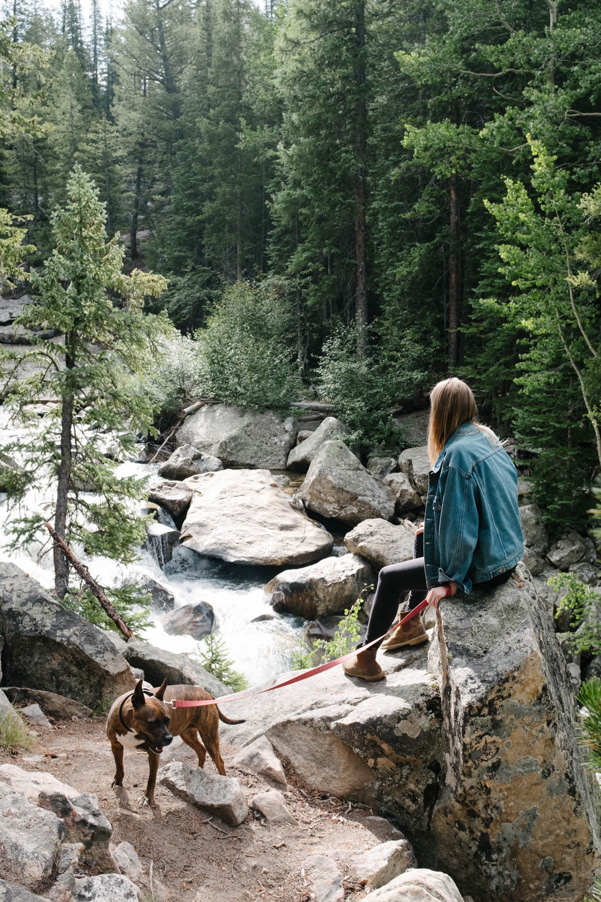

We left STL on August 23rd to begin our trip around the West, enventually ending with our arrival in Los Angeles to start living on the West Coast. My grandma was sick but stable, so I decided it was ok to go, not knowing how her situation would play out or for how long. We made it to Leadville, CO the next day and thinking it was the first night of an extended road trip, we partied hard. And the next day, oooh boy did I pay for it. We took a morning drive across Independence Pass with me begging the world for mercy. What a fun guy, eh?

Within 24 hours of arrival, I recieved a call saying she had taken a turn for the worst. Time to head back.